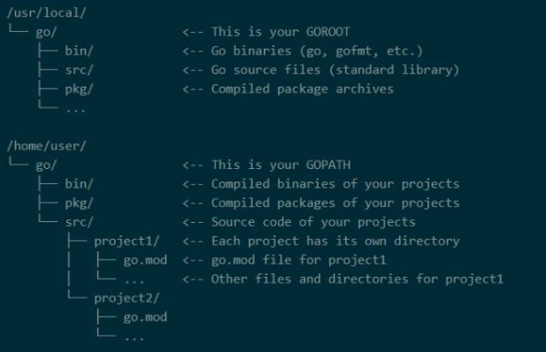

# NTUA-Analysis-and-Design-of-Information-Systems
This is a repo for the <code>Analysis and Design of Information Systems</code> Project (2023-2024), which compares 2 timeseries databases, InfluxDB and TimescaleDB. It contains instructions to set the environment up, scripts to automate the execution of commands in order to avoid repetitive work and the results of our investigation in PNG form. 

<i><b>Important notice:</b> Since this repo uses the commands provided by <a href="https://github.com/timescale/tsbs">TSBS</a>, readers should first read that README, before proceeding here for a better understating of the commands and the environment we set.</i>

The following instructions set up the project in
Ubuntu 16.04 machines. If that's not the case for you, links
for the respective guides are provided below to support
your machine.

<ul>
  <li><a href="https://docs.timescale.com/self-hosted/latest/install/"> TimescaleDB (v2.4.0) (single node version) </a></li>
  <li><a href="https://docs.influxdata.com/influxdb/v1/introduction/download/"> InfluxDB v1 OSS (v1.8.10) </a></li>
  <li><a href="https://www.postgresql.org/download/"> PostgreSQL 13 </a></li>
  <li><a href="https://go.dev/doc/install"> Golang (v.1.21.6) </a></li>
</ul>

## Repo Structure
### <i><code>scripts:</code></i>
Every folder contained here has to be placed in the tsbs root directory
of the repo that we'll clone (described later in the steps).

### <i><code>Metrics_Comparison:</code></i>
PNG files of the metrics compared in this project in addition to the python scripts used to create them. These were created using the <code>metrics_visualizer.py</code> script, which reads data from the <code>influx.py</code> and <code>timescale.py</code> to visualize them.


##  1. Installation and Setup

### Download and Install tools and databases
```bash
# Update your system
sudo apt-get update
sudo apt-get upgrade

# Install wget package manager
sudo apt-get install wget

# Download and install InfluxDB (v1.8.10)
wget https://dl.influxdata.com/influxdb/releases/influxdb_1.8.10_amd64.deb
sudo dpkg -i influxdb_1.8.10_amd64.deb
sudo service influxdb start

# Download and install Postgres 13
wget --quiet -O - https://www.postgresql.org/media/keys/ACCC4CF8.asc | sudo apt-key add -
echo "deb http://apt-archive.postgresql.org/pub/repos/apt/ $(lsb_release -cs)-pgdg main" | sudo tee /etc/apt/sources.list.d/pgdg.list
sudo apt-get update
sudo apt-get install postgresql-13
sudo -u postgres psql -c "SELECT version();" # Verify installation

# Download and install TimescaleDB
sudo add-apt-repository ppa:timescale/timescaledb-ppa
sudo apt-get update
sudo apt-get install timescaledb-2-postgresql-13
sudo timescaledb-tune
sudo service postgresql restart

#Download and install Go (v.1.21.6)
wget https://golang.org/dl/go1.21.6.linux-amd64.tar.gz
sudo tar -C /usr/local -xzf go1.21.6.linux-amd64.tar.gz
```

### Set environment variables for Go workspace
```bash
# Go binaries, source files etc are located in /usr/local/go
# Set these environment variables in ~/.bashrc
echo 'export PATH=$PATH:/usr/local/go/bin' >> ~/.bashrc
echo 'export GOPATH=$HOME/go' >> ~/.bashrc
echo 'export PATH=$PATH:$GOPATH/bin' >> ~/.bashrc
echo 'export GOROOT=/usr/local/go' >> ~/.bashrc
source ~/.bashrc
```
Your Go workspace should now be set up and look like this:
(the repo that we will work in *(TSBS)* will be cloned where project1 is, under src)



### Clone TSBS repo
```bash
# Create a dir named 'src' under $GOPATH
# where we will store our repo
mkdir $GOPATH/src
cd $GOPATH/src

# Clone the TSBS repo and build it in the src we created
git clone https://github.com/timescale/tsbs.git
cd tsbs
make
```
## 2. Data generation and loading to the DBs

We used TSBS for the data generation and
loading. More specifically:

<ul>
  <li> Create 6 databases, 3 Influx DBs and 3 Timescale DBs, named small, medium and big, 1 for each DB. </li>
  <li> In the tsbs repo we previously cloned and under the root directory, create a directory named <code>datasets</code>, in which datasets will be stored. </li>
  <li> Right after, we run the <code>generate_data.sh</code>, which creates the 6 datasets using the <code>tsbs_generate_data</code> command, in a zipped form, and stores them under the directory we previously created.</li>
</ul> 

```bash
mkdir datasets
# uncomment the next line if you don't have
# execution permission on the script 
# chmod +x generate_data.sh
./generate_data.sh
```

## 3. Query generation

For this step, we execute each script inside the <code>generate_queries</code> folder.
Results are stored in a zipped form inside the <code>queries</code> folder. For example, in
order to create and then view the zipped files in the <code>queries/influx_big</code> folder:

```bash
cd generate_queries
./influx_big.sh
cd ..
ls queries/influx_big
```

This will create 15 zipped files, 1 for each query type, containing 1000 queries each, 
to be used for the influx big database. For more info on the flags used, you can
take a look at the corresponding section of TSBS as mentioned earlier.

## 4. Measurement and visualization of relevant performance metrics 

At this point, we have generated and stored the queries that will be executed.
So the next step is execution. Following the same logic as before, we move to the
<code>run_queries</code> folder, where we are faced with 2 folders <code>run_influx</code> and
<code>run_timescale</code>. Since the logic is similar, let's say that we get in the
influx folder. We are then faced with scripts named <code>run_influx_small/medium/big_1/2/4</code>,
denoting the base that the queries will be run against and the number of workers to be used.
For example, if we want to query the influx big database using 4 workers, we follow this flow:

```bash
cd run_queries
cd run_influx
./run_influx_big4.sh
```

The steps mentioned (data loading, query generation, query execution) produce metrics
that we store in the <code>influx.py</code> and <code>timescale.py</code> respectively.
Each of these files contains a small description about the format of its data. The 
<code>metrics_visualiser.py</code> then uses these data in order to visualize them,
so that results can be easily inferred.


  


